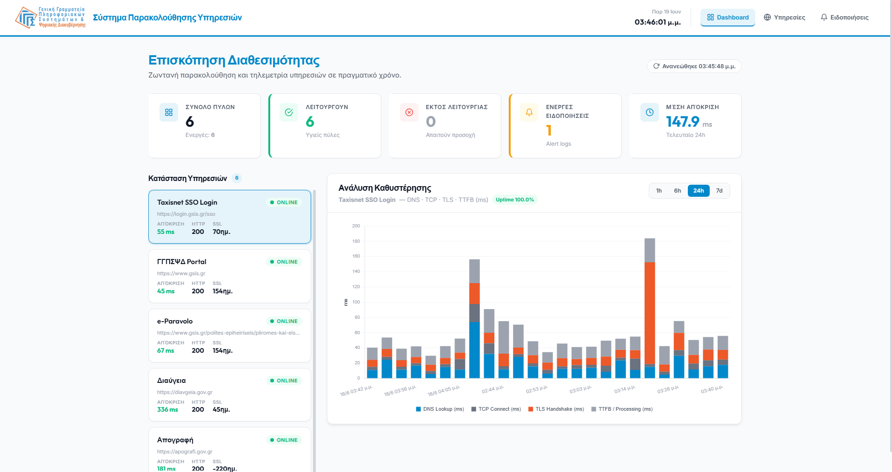
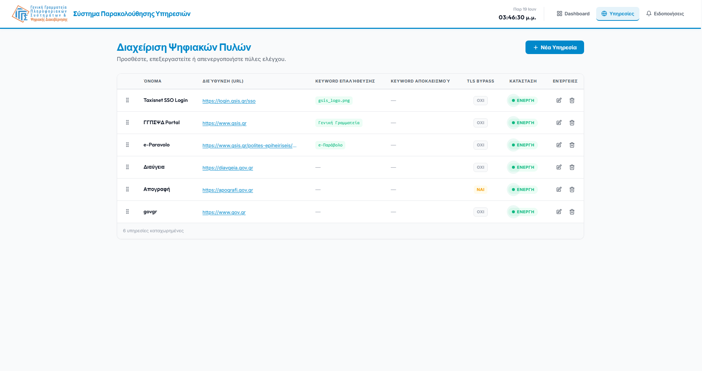
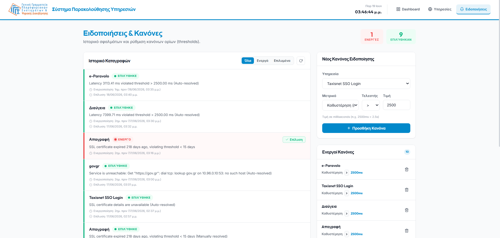

# GSIS Monitor

GSIS Monitor is a real-time observability dashboard and pinger daemon developed as part of an internship at the General Secretariat of Information Systems. It is designed to monitor the availability, network latency (DNS, TCP, TLS, and TTFB), content integrity, and SSL certificate validity of public portals and services.

## Key Features

* **Real-Time Observability**: Provides an Outfit-styled, responsive dashboard displaying status summaries, metrics, latency charts, and alert logs.
* **Granular Latency Tracking**: Performs network diagnostic HTTP tracing using Go's `net/http/httptrace` to measure and record DNS lookup, TCP connection, TLS handshake, and Time-To-First-Byte (TTFB) breakdowns.
* **Security & Integrity Checks**: Monitors SSL/TLS certificate expiry dates and performs content verification by checking for the presence of custom validation keywords and the absence of exclusion keywords.
* **Automated Alert Management**: Evaluates telemetry logs against configurable alert rules (e.g., latency thresholds, SSL certificate expiration) and automates alert logs with self-healing auto-resolve checks.
* **Containerized Deployment**: Supports local execution via Docker Compose or cluster deployment on Kubernetes (Minikube) utilizing multi-stage Docker builds and secure secret management.

> **External Black-Box Monitoring**: All latency breakdowns (DNS, TCP, TLS, TTFB) and SSL certificate expiry metrics are measured externally via periodic HTTP/TCP request probes initiated by the Go pinger daemon. They represent the connection performance and status from the pinger's network location rather than internal statistics queried directly from the target servers.

---

## Screenshots

### 1. Dashboard View

*The main dashboard interface showing service statuses, quick status summaries, and real-time latency charts.*

### 2. Services Management

*Management page for adding, modifying, or deleting monitored portals and endpoints.*

### 3. Alerts & Rules Management

*List of active and resolved system alert logs, as well as the interface to manage configuration threshold rules.*

---

## Prerequisites

To run, develop, or test the GSIS Monitor, ensure the following tools are installed:

* **Docker & Docker Compose** (for local containerized database)
* **Kubernetes & Minikube** (for cluster deployment)
* **Python v3.11+** (for FastAPI backend development)
* **Node.js v20+ & npm** (for SvelteKit frontend development)
* **Go v1.22+** (for pinger daemon development)

---

## Project Structure

```text
GSIS-Monitor/
├── Dockerfile                  # Multi-stage build targeting backend, pinger, and frontend
├── docker-compose.yml          # Local database orchestrator (TimescaleDB)
├── backend/                    # FastAPI web server and database models
│   ├── main.py                 # FastAPI application and endpoint entry points
│   ├── config.py               # Pydantic Settings env loader
│   ├── models.py               # Database ORM models
│   └── test_main.py            # Backend test suite (pytest)
├── pinger/                     # Go pinger daemon
│   ├── main.go                 # Daemon main loops & scheduler
│   ├── pinger.go               # HTTP tracer and SSL diagnostics
│   └── pinger_test.go          # Go test suite
├── frontend/                   # SvelteKit SPA Frontend
│   ├── src/
│   │   ├── global.css          # Consolidated single-line CSS styles
│   │   └── routes/             # SvelteKit routing pages (+layout, dashboard, alerts, services)
│   └── package.json            # npm package dependencies and build scripts
└── k8s/                        # Kubernetes manifests (deployments, configmaps, services)
```

---

## Configuration

The application reads database configuration variables from a `.env` file at the root of the repository.

```env
DB_HOST=localhost
DB_PORT=5433
DB_NAME=gsis_monitor
DB_USER=gsis_user
DB_PASSWORD=your_password_here
```

---

## Installation & Local Setup

### 1. Database (TimescaleDB)
Start the TimescaleDB container locally using Docker Compose:
```bash
docker-compose up -d
```
The database will be exposed on host port `5433` and initialized with the schema from [db/init.sql](file:///db/init.sql).

### 2. FastAPI Backend
Navigate to the `backend` directory to set up the virtual environment and install dependencies:
```bash
cd backend
python -m venv .venv
# Activate on Windows:
.venv\Scripts\activate
# Activate on Linux/macOS:
source .venv/bin/activate

pip install -r requirements.txt
```

Navigate back to the repository root directory and run the FastAPI server:
```bash
cd ..
python -m uvicorn backend.main:app --reload --port 8000
```
*API documentation will be available at `http://localhost:8000/docs`.*

### 3. SvelteKit Frontend
Navigate to the `frontend` directory, install dependencies, and start the development server:
```bash
cd frontend
npm install
npm run dev -- --port 3000
```
*Frontend interface will be available at `http://localhost:3000`.*

### 4. Go Pinger Daemon
Navigate to the `pinger` directory, fetch dependencies, and run the daemon:
```bash
cd pinger
go mod download
go run main.go db.go pinger.go types.go
```

---

## Quickstart (Local Stack Deployment)

To run the entire stack locally with standard development configurations:

1. Copy `.env.example` to `.env` and configure your credentials.
2. Spin up the database:
   ```bash
   docker-compose up -d
   ```
3. Run the Backend, Frontend, and Pinger daemons locally as described in the [Installation & Local Setup](#installation--local-setup) section.

---

## Kubernetes Deployment (Minikube)

GSIS Monitor is fully containerized and deployable to a Minikube cluster. It uses Go multi-stage Docker builds to compile binaries inside the container, eliminating local binary requirements.

### 1. Setup Minikube Environment
Direct your shell to Minikube's Docker daemon:
```bash
# Windows PowerShell:
& minikube -p minikube docker-env --shell powershell | Invoke-Expression
# Linux/macOS:
eval $(minikube docker-env)
```

### 2. Create Database Secret Dynamically
Create the Kubernetes Secret containing database credentials from your local `.env` file (so credentials are not committed to Git):
```bash
kubectl create secret generic gsis-monitor-secret --from-env-file=.env
```

### 3. Build Docker Images
Build the multi-stage target images directly inside the Minikube registry:
```bash
docker build --target backend -t gsis-monitor-backend:latest -f Dockerfile .
docker build --target pinger -t gsis-monitor-pinger:latest -f Dockerfile .
docker build --target frontend -t gsis-monitor-frontend:latest -f Dockerfile .
```

### 4. Deploy Manifests
Deploy the ConfigMaps, Services, and Deployments:
```bash
kubectl apply -f k8s/
```

### 5. Open Ingress Routing
In a separate terminal, open the Minikube tunnel to expose LoadBalancer services locally:
```bash
minikube tunnel
```
* Access the dashboard at `http://localhost:3000`
* Access API documentation at `http://localhost:8000/docs`

---

## Running Tests

### 1. Backend Python Unit Tests
Run the pytest suite from the root of the repository (with the backend virtual environment active):
```bash
python -m pytest backend/test_main.py
```

### 2. Go Pinger Unit Tests
Navigate to the `pinger` directory and run the Go test suite:
```bash
cd pinger
go test -v ./...
```
